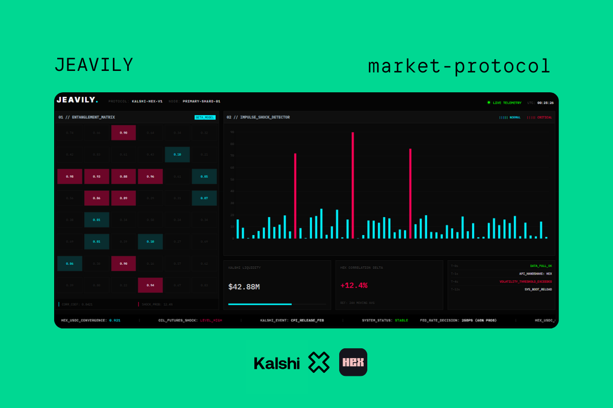

# jeavily-market-protocol
# JEAVILY: Quantifying Market Entanglement

> **"Prediction markets tell you *what* will happen. Jeavily tells you *why*."** 

## ⚡ The Protocol
Jeavily is a high-dimensional signal processing engine designed to detect hidden correlations ("Entanglement") between seemingly unrelated prediction markets. By treating global events as a neural network, Jeavily identifies how volatility in one sector (e.g., *Fed Rates*) bleeds into another (e.g., *Tech Stocks*).

## 🧠 The Math Engine
The core logic relies on two proprietary metrics:

1.  **The Entanglement Matrix:** A vectorized Pearson Correlation analysis that aligns disparate timeframes to map the "invisible wires" connecting global markets.
2.  **The Volatility Z-Score:** A rolling statistical stress-test that flags **3-Sigma Events** ($\sigma > 3$)—moments where market sentiment decouples from reality.

$$Z = \frac{x - \mu}{\sigma}$$

## 🛠 Tech Stack
* **Engine:** Python (Pandas, NumPy, SciPy)
* **Visualization:** Plotly (Dark Mode Signal Rendering)
* **Data Source:** Synthetic High-Fidelity Stress Data (Simulating Black Swan Events)

## 🚀 How to Run
This protocol is deployed as a self-contained Jupyter Notebook.
1.  Open `Jeavily_Core_Engine.ipynb` in GitHub.
2.  Click "Open in Colab" (if you have the extension) or download to run locally.
3.  Execute the **Master Protocol** cell to initialize the Ghost Loader and render the Dashboard.
